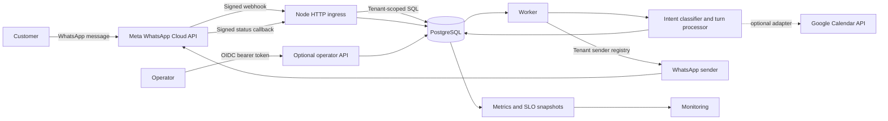
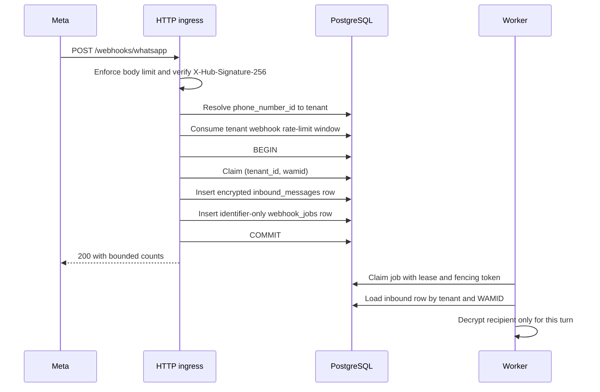

# 01 — System Architecture (As-Is)

> Last verified against the working tree on **2026-09-25**. This document describes implemented repository behavior, not the product vision or a future-state design. External sources validate platform behavior and security expectations; they do not prove that this deployment is compliant or production-ready.

## 1. Purpose and scope

Sela's runnable appointment workflow lives in `apps/appointment-agent`. The current system accepts signed WhatsApp webhooks, resolves the sender to a tenant, durably queues one customer turn, executes a bounded reschedule state machine, records calendar mutations in PostgreSQL, and sends tenant-scoped WhatsApp replies through a durable delivery ledger.

This document covers:

- runtime modes and component ownership;
- signed ingress, queueing, worker execution, rescheduling, and outbound delivery;
- data classification, tenant boundaries, failure semantics, and observability;
- implemented security controls and unresolved production gaps.

It does not claim that the pilot is production-ready, that Google Calendar is the active source of truth, or that the system satisfies a compliance framework. SMS, voice transcription, autonomous cross-tenant booking, a production operator workspace, and live provider smoke evidence are outside the implemented path.

## 2. Architecture drivers

| Driver | Current architectural response |
|---|---|
| Meta webhook retries can duplicate events | Verify the raw body signature, claim `(tenant_id, wamid)` once, and enqueue the retained message and job in one transaction. [M1][M2] |
| A reschedule must not create a double booking | Use an expiring hold, optimistic appointment versioning, row locks, a unique calendar operation key, and one atomic database transaction. |
| Customer text and phone numbers are sensitive | Persist raw text only in bounded `inbound_messages` rows; propagate only opaque conversation identifiers; encrypt the reply target with AES-256-GCM; keep queue/session/ledger tables free of raw content and recipients. |
| Tenant context must survive asynchronous work | Resolve the tenant from the provider channel, persist it on the job, filter every load/write by tenant, and select an explicit sender registry. [O1] |
| Provider calls are ambiguous and rate-limited | Claim outbound operations before I/O, persist provider acknowledgements, stop automatic retry on unknown outcomes, and apply tenant-scoped limits. |
| Operators perform privileged actions | Require an injected OIDC verifier, validate tenant membership and permission, require MFA for destructive actions, and append audit evidence. [O2][O3] |
| Failures must be diagnosable without exposing sensitive data | Emit bounded JSON logs and Prometheus text metrics without message, recipient, token, or unbounded tenant labels. |

## 3. System context and trust boundaries



### Assets

- tenant and conversation isolation;
- appointment state and source-of-truth integrity;
- inbound message text, sender references, and phone numbers;
- Meta, Google, OIDC, and database credentials;
- reschedule, rejection, delivery, and operator-action evidence.

### Trust boundaries

| Boundary | Controls at the boundary |
|---|---|
| Internet → HTTP server | TLS is a deployment responsibility; Meta requests are limited to 3 MiB, verified against the exact raw body, and bounded by a 2.5-second response deadline. [M1] |
| Webhook → tenant context | `phone_number_id` is resolved through `tenant_channels`; an unknown channel creates no job and is counted as unresolved. |
| Queue → worker | A worker uses the persisted tenant, reloads the inbound row by `(tenant_id, wamid)`, and fences lifecycle writes with a claim token. |
| Application → PostgreSQL | Queries are parameterized and tenant-scoped. The worker role is `service_role`, which the migrations explicitly treat as RLS-bypassing; isolation therefore also depends on correct application predicates and least-privilege server access. [P1][O1] |
| Worker → messaging provider | A registry must resolve a sender for the claimed tenant before provider I/O; the durable ledger fences replay and ambiguous outcomes. |
| Operator → control plane | The endpoint is absent unless verifier and service dependencies are injected; authentication, tenant authorization, MFA, rate limiting, and audit are required for enabled actions. [O2][O3] |
| PostgreSQL → Google Calendar | The current database writer does not delegate atomic reschedules to Google. The adapter fails closed, and provider reconciliation remains open. [G1][G2] |

## 4. Runtime modes

`src/index.ts` and `src/composition.ts` select the runtime. Persistence is explicit: `DATABASE_URL` and `USE_IN_MEMORY=true` are mutually exclusive, and the composition fails closed if neither is set.

| Mode | Selection | Persistence | Network behavior |
|---|---|---|---|
| Local CLI | default `APP_MODE=cli` or `pnpm dev` | In-process slot service and test helpers | No server or worker; no production sender |
| HTTP + worker | `APP_MODE=server` or `pnpm start` | PostgreSQL by default | Starts both HTTP ingress and worker |
| Worker only | `APP_MODE=worker` | PostgreSQL by default | Claims jobs without starting HTTP |
| Explicit local server | `USE_IN_MEMORY=true` | Process memory with an ephemeral recipient key | Non-network sender; rows do not survive restart |

A database-backed environment-built sender is single-tenant. A global worker claimer is permitted only when deployment code injects a sender registry explicitly marked as covering every tenant that can enqueue work.

## 5. Component map

| Component | Code | Responsibility |
|---|---|---|
| HTTP adapter | `src/http/server.ts` | Route framing, raw-body limits, ACK deadline, health, metrics, and optional operator API |
| Webhook boundary | `src/webhook_handler.ts` | Signature invariant, schema validation, tenant resolution, dedupe, retention, queueing, and status callbacks |
| Atomic ingress | `src/ingress/postgres_atomic_ingress.ts` | Transactionally claim, retain, and enqueue one inbound message |
| Job queue | `src/worker/job_claim.ts`, `src/worker/job_store.ts` | `FOR UPDATE SKIP LOCKED` claims, stale-lease recovery, fencing, retries, and terminal states [P2][P3] |
| Job processor | `src/worker/process_job.ts` | Tenant-scoped load, retention/service-window checks, transient decryption, turn execution, delivery, and completion |
| Reschedule processor | `src/reschedule/turn_processor.ts` | Button state machine, source appointment validation, hold selection, confirmation, expiry, replay, and handoff |
| Session store | `src/reschedule/postgres_session_store.ts` | PII-minimal state with optimistic compare-and-swap versioning |
| Calendar writer | `src/calendar/postgres_calendar.ts` | Durable holds, confirmations, atomic reschedules, operation replay, and audit evidence |
| Outbound delivery | `src/outbound/durable_outbound_registry.ts` | Ledger claim, outbound rate limit, provider send, acknowledgement, and unknown-outcome fencing |
| Sender selection | `src/outbound/sender_registry.ts` | Single-tenant or explicitly complete multi-tenant credential routing |
| Operator API | `src/http/operator_api.ts`, `src/enterprise/*` | OIDC verification, tenant authorization, MFA, rate limiting, action dispatch, and audit |
| Observability | `src/observability/*` | Bounded metrics, SLO evaluation, and alert candidates |
| Database gate | `src/persistence/production_gate.ts` | Read-only schema, RLS, grants, timeout, TLS, and external recovery-evidence checks |
| Google adapter | `src/tools/google_calendar_adapter.ts`, `packages/mcp-gcal` | Free/busy queries and a process-local event-backed hold adapter; atomic reschedule is not supported |

The LangGraph graph in `src/graph.ts` remains a local/legacy flow scaffold. The database-backed worker uses `RescheduleTurnProcessor` plus the PostgreSQL session store for its durable button state. The graph's `interrupt()` must not be described as a production checkpointer contract in the current composition.

## 6. Signed inbound-message flow



Important semantics:

1. Signature verification uses the exact raw request bytes and a server-side app secret. The verify token is used only for the GET subscription challenge. [M1]
2. The accepted body limit is 3 MiB, matching Meta's documented maximum. [M2]
3. Tenant resolution occurs before rate limiting and persistence. An unresolved channel is acknowledged but not queued, preventing repeated retries from creating work without an owner.
4. The inbound phone number is converted to a SHA-256 conversation identifier and encrypted as a versioned AES-256-GCM reply target. Plaintext and ciphertext are not copied into the queue job, session, metrics, or logs.
5. In PostgreSQL mode, the dedupe claim, retained inbound row, and queue job commit atomically. A duplicate is successful only when its existing claim still has a complete inbound/job relationship.
6. The HTTP deadline aborts in-flight work. Persistence or rate-limiter uncertainty returns `503`, allowing Meta to retry; invalid or unsigned input returns `401` or `400`.

## 7. Worker execution and retries

`run_worker_loop` repeatedly asks `PostgresJobClaimer` for the oldest available job. PostgreSQL row locks with `SKIP LOCKED` let replicas claim different jobs without holding the same row. Each claim receives a fresh `claim_token`; completion or failure updates must match that token. A stale `claimed` row becomes reclaimable after five minutes. [P2][P3]

For one job, the worker:

1. rejects a missing tenant;
2. loads the inbound row by `(tenant_id, wamid)` and checks scope, expiry, future-clock skew, the 24-hour service window, and reply-target availability;
3. decrypts the reply target only in memory;
4. executes one reschedule turn;
5. sends every draft through the tenant's durable outbound registry;
6. marks the inbound row processed and the job completed.

Expected terminal skips include missing/expired inbound data, missing tenant, scope mismatch, invalid timestamps, expired service window, and missing encrypted target. Other failures are retried with bounded exponential backoff until `WORKER_MAX_ATTEMPTS`; raw error text is reduced to a sanitized code.

The current worker enforces a 24-hour customer service window. It does not yet provide an approved template path for older conversations.

## 8. Reschedule state machine

```mermaid
stateDiagram-v2
    [*] --> offered: trusted source appointment + bounded offers
    offered --> awaiting_confirmation: pick current-generation slot + durable hold
    awaiting_confirmation --> confirmed: confirm_move + atomic calendar reschedule
    awaiting_confirmation --> cancelled: confirm_cancel + hold release
    awaiting_confirmation --> offered: hold/slot expired or unavailable
    offered --> handoff: ambiguous, unsafe, or unauthorized context
    awaiting_confirmation --> handoff: version/state conflict; hold released
    confirmed --> [*]
    cancelled --> [*]
    handoff --> [*]
```



### Session invariants

- Scope is `(tenant_id, conversation_id)`; no global conversation key is accepted.
- The trusted appointment ID comes from trusted server-side context, never from parsing free text.
- Only a `confirmed`, same-tenant appointment may be offered for reschedule.
- Offers are sorted and bounded. The graph may inspect up to three candidates; the durable button session persists at most two.
- A button is valid only when its action and `offer_generation` match the current session.
- Session updates use optimistic compare-and-swap on `version`; a conflict is retried/reconciled or fails closed.
- Duplicate WAMIDs replay the persisted phase; unknown/stale buttons are rejected without calendar access.
- Ordinary sessions expire after 24 hours. Handoff tombstones remain for 30 days.
- Customer free text is not copied into `reschedule_sessions`.

### Calendar transaction invariants

`PostgresCalendarWriter.reschedule_appointment` is the only implemented atomic source-appointment move. In one transaction it:

1. takes a transaction advisory lock for `(tenant, operation_key)`;
2. replays a committed result when the same key and fingerprint are retried;
3. locks the source appointment and verifies same-tenant ownership, `confirmed` status, and `expected_version`;
4. locks the target hold and verifies it is live and belongs to the same tenant, resource, slot, and time range;
5. releases the held appointment row;
6. moves the confirmed source appointment to the target resource and time;
7. confirms the hold against the moved appointment;
8. appends audit evidence and commits the operation result.

A reused operation key with a different request fingerprint is a conflict. PostgreSQL row/advisory locks are application-coordinated correctness mechanisms, not proof that every deployment role is least-privileged. Deadlocks remain possible and must be surfaced as retryable system failures rather than swallowed. [P2]

## 9. Outbound delivery state

The durable ledger is keyed by `(tenant_id, provider, operation_key)`. The operation key is derived from stable inbound/turn identifiers, so each outbound draft has an independent replay boundary.

```text
pending -> sending -> sent -> delivered -> read
                     |         \-> failed
                     \-> failed
                     \-> unknown
```

- A live `sending` lease is not stolen.
- A committed success is replayed without another provider call.
- An expired `sending` lease becomes `unknown`, not an automatic resend.
- Timeouts, transport failures, and upstream failures after provider I/O may be ambiguous and are recorded as `unknown`; operator reconciliation is required.
- Explicit non-ambiguous failures are terminal unless the ledger records a retry deadline.
- Signed status callbacks are resolved to the same tenant and applied monotonically under a row lock.
- The ledger stores safe operation/provider identifiers and codes, not a recipient, message body, access token, or raw provider response.

The in-memory ledger and synthetic acknowledgement are allowed only in explicit local/test composition. Database-backed sends require a real provider WAMID.

## 10. Data classification and ownership

| Store | Classification | Contents and ownership |
|---|---|---|
| `inbound_messages` | Restricted/PII-bearing | Bounded message text, opaque sender reference, optional trusted appointment ID, encrypted reply target, receipt/expiry/processed timestamps |
| `webhook_jobs` | Internal, PII-minimal | Tenant, WAMID, hashed conversation ID, request ID, timestamps, lease/retry lifecycle |
| `reschedule_sessions` | Internal, PII-minimal | Tenant/conversation scope, phase, source version, bounded slots, hold IDs, generation, CAS version |
| `appointments` and `appointment_holds` | Business-critical | Tenant-owned scheduling state, versions, resources, expiries, and operation keys |
| `calendar_operations` | Internal correctness evidence | Tenant-scoped idempotency key, request fingerprint, and committed result |
| `outbound_ledger` | Internal, PII-minimal | Delivery lifecycle, provider message IDs/codes, leases, and retry state |
| `tenant_rate_limits` | Internal abuse-control state | Tenant, bounded scope, fixed-window counter, and limit configuration |
| `audit_log` / `operator_action_audit` | Restricted audit evidence | Actor/action/target/outcome evidence; no credentials or message body |

Default inbound retention is 30 days. Active legal holds must be checked before retention deletes covered data. Database-backed deployment requires a stable recipient-encryption key from a secret manager; rotating it without re-encryption makes retained reply targets undecryptable.

## 11. Security controls

### Tenant isolation

- Provider channel ownership is resolved server-side; a client-supplied tenant ID is never accepted as webhook authorization.
- The verified tenant is persisted on every job and reapplied at load, session, calendar, ledger, and sender boundaries.
- SQL reads and writes include tenant predicates; composite keys and tenant foreign keys prevent cross-tenant relationships.
- RLS protects `authenticated` client access through transaction-local `app.current_tenant` context.
- The server worker deliberately uses the RLS-bypassing `service_role`. This is an explicit high-trust boundary: every worker query must remain tenant-parameterized, and database credentials must not be exposed to tenant-facing clients. [P1][O1]

### Webhook and API controls

- Raw-body HMAC verification, bounded body size, method allowlists, generic client errors, `Cache-Control: no-store`, and `X-Content-Type-Options: nosniff` are applied by the HTTP boundary.
- Webhook, outbound, and operator limits use PostgreSQL fixed windows keyed by tenant and scope. A limiter outage fails closed.
- The operator API accepts only a configured RS256 issuer/JWKS, validates issuer, audience, subject, session, time claims, and tenant roles, and requires MFA for privileged non-audit actions.
- The optional endpoint is not registered unless its verifier and action service are injected.

### Data protection and secrets

- Recipient phone numbers use AES-256-GCM with a unique 96-bit IV and a versioned authenticated envelope.
- Meta app secret, API token, OIDC configuration, database URL, and encryption key are environment/secret-manager inputs and must not be placed in URLs, logs, metrics, or documentation.
- The process-local in-memory key is intentionally ephemeral and unsuitable for retained rows.

### Logging and audit

- Runtime error logs contain request/job IDs, tenant ID where operationally necessary, stable error classes/codes, and no raw provider error body.
- Metrics labels are bounded and exclude tenant, conversation, WAMID, recipient, and message identifiers to avoid high-cardinality or sensitive telemetry.
- Reschedule rejection, calendar transition, outbound state, and privileged operator actions have dedicated evidence paths.

## 12. Failure semantics

| Condition | HTTP/queue result | Business result |
|---|---|---|
| Invalid signature or verify challenge | `401` | No tenant resolution or job |
| Body/payload invalid or too large | `400` / `413` | No job |
| Duplicate inbound WAMID | `200` duplicate count | Existing job/evidence remains authoritative |
| Unknown channel account | `200` unresolved count | No job; monitoring signal only |
| Tenant rate limit exhausted | `429` with `Retry-After` | Meta may retry later |
| Database/limiter/ledger unavailable | `503` | No unsafe fallback to process memory |
| HTTP deadline exceeded | `503` and abort signal | Transaction rolls back; Meta may retry |
| Worker stale claim | reclaim after lease | Old fenced lifecycle write cannot win |
| Service window expired | terminal job skip | No outbound reply |
| Session CAS conflict | worker retry/error | Stale button cannot overwrite newer phase |
| Hold expired/slot unavailable | release/reoffer | No calendar write |
| Appointment missing/not reschedulable/version conflict | release hold and handoff | No unsafe retry loop |
| Ambiguous outbound provider result | ledger `unknown` | No automatic resend; operator action required |

## 13. Observability and operations

The HTTP server exposes:

| Endpoint | Purpose | Current boundary |
|---|---|---|
| `GET /healthz` | Process liveness | Does not prove database/provider readiness |
| `GET /metrics` | Prometheus text exposition | In-process registry; no tenant/message labels; restrict at the network layer |
| `POST /webhooks/whatsapp` | Meta inbound messages and statuses | Signature verification required |
| `POST /v1/operator/actions` | Privileged control-plane actions | Disabled unless dependencies are injected |

SLO targets and alert candidates are defined in `src/observability/slo.ts`, including a 3-second webhook ACK target, queue-age alert, worker success ratio, outbound success ratio, and outbound latency. Prometheus defines the text exposition format and requires a supported content type; verify the deployed scraper against the exact response contract. [PR1]

Database production evidence is checked by `pnpm --filter appointment-agent db:gate`. The gate is read-only and requires schema objects, enabled RLS, expected grants, bounded database timeouts, TLS, and externally supplied backup/restore evidence. It does not replace migration testing, penetration testing, provider smoke tests, or a disaster-recovery exercise.

## 14. External integration boundaries

### Meta WhatsApp Cloud API

Meta documents three requirements that directly shape this implementation: a GET verification challenge, HMAC-SHA256 validation of the exact POST body using the app secret, and deduplication because failed deliveries are retried for up to seven days. [M1][M2] The current design follows all three. Provider throughput and customer-service eligibility remain account- and template-specific and must be verified in staging.

### Google Calendar

Google's event `update` method replaces the full event and recommends a get/update sequence with ETags for atomicity. Google also documents `412 conditionNotMet` for stale `If-Match` values and differentiated retry behavior for rate limits, not-found, conflict, and server errors. [G1][G2]

The current `GoogleCalendarAdapter` approximates service slots from working hours and free/busy, represents a hold as a marked event, and keeps hold metadata in process memory. It explicitly rejects `reschedule_appointment`. Therefore:

- PostgreSQL is the active durable appointment writer;
- Google Calendar is not yet a transactionally reconciled source of truth;
- provider success-after-timeout and bidirectional reconciliation remain production blockers;
- an ETag/If-Match contract and reconciliation state machine are required before replacing the local writer.

## 15. Known gaps and explicit exclusions

1. **Trusted appointment context:** the Meta ingress does not yet attach a trusted `appointment_id`; the upstream server workflow that does so is still required for real rescheduling.
2. **Provider reconciliation:** no durable reconciliation exists between the PostgreSQL source appointment and Google Calendar, including success-after-timeout behavior.
3. **Production sender registry:** environment composition is single-tenant. A secret-backed per-tenant registry, rotation, coverage verification, and unknown-outcome operator runbook remain deployment work.
4. **RLS-bypassing worker role:** application-level tenant predicates are the primary worker isolation boundary. Production evidence must prove the deployed role, grants, connection path, and cross-tenant negative tests.
5. **Operator control plane:** authentication/authorization primitives exist, but production OIDC rollout, operator workspace, approval policy, and action-handler deployment are not complete.
6. **Live provider evidence:** no automated test performs a live Meta send. Staging credentials, approved template, signed inbound/button/status callbacks, and delivery callbacks are still required.
7. **Metrics topology:** the registry is process-local and resets on restart. Multi-replica deployments need a real metrics backend and scrape policy; `/metrics` must not be treated as a public browser endpoint.
8. **Older conversations:** messages outside the 24-hour service window are skipped until an approved template path exists.
9. **Production infrastructure:** repository code and gates exist, but deployment manifests, regional/DR topology, retention scheduling, alerting integration, and operational sign-off are not proven by this document.

## 16. Research sources

External pages were accessed on **2026-09-25**. Repository behavior is sourced from the code paths listed above.

| ID | Source | Supported claim |
|---|---|---|
| M1 | Meta, [Create a webhook endpoint](https://developers.facebook.com/documentation/business-messaging/whatsapp/webhooks/create-webhook-endpoint) | GET challenge, exact-body HMAC-SHA256, valid TLS, batching, and retry/deduplication requirements |
| M2 | Meta, [WhatsApp webhooks overview](https://developers.facebook.com/documentation/business-messaging/whatsapp/webhooks/overview) | Incoming messages/status events, 3 MiB payload maximum, and retries for up to seven days |
| G1 | Google, [Events: update](https://developers.google.com/workspace/calendar/api/v3/reference/events/update) | Full-resource update semantics and ETag-based get/update atomicity |
| G2 | Google, [Handle Calendar API errors](https://developers.google.com/workspace/calendar/api/guides/errors) | `412` stale ETag behavior, rate-limit backoff, and error-specific retry semantics |
| P1 | PostgreSQL, [Row Security Policies](https://www.postgresql.org/docs/current/ddl-rowsecurity.html) | RLS semantics, default deny without policies, and owner/superuser/`BYPASSRLS` exceptions |
| P2 | PostgreSQL, [Explicit Locking](https://www.postgresql.org/docs/current/explicit-locking.html) | Row-lock behavior, deadlocks, and transaction-scoped advisory locks |
| P3 | PostgreSQL, [SELECT locking clause](https://www.postgresql.org/docs/current/sql-select.html#SQL-FOR-UPDATE-SHARE) | `FOR UPDATE` and `SKIP LOCKED` syntax and semantics |
| O1 | OWASP, [Multi-Tenant Application Security Cheat Sheet](https://cheatsheetseries.owasp.org/cheatsheets/Multi_Tenant_Security_Cheat_Sheet.html) | Verified tenant context, tenant-aware async work/rate limits, RLS role caveats, and negative isolation tests |
| O2 | OWASP, [Authorization Cheat Sheet](https://cheatsheetseries.owasp.org/cheatsheets/Authorization_Cheat_Sheet.html) | Deny-by-default, per-request authorization, least privilege, safe failure, logging, and authorization tests |
| O3 | OWASP, [REST Security Cheat Sheet](https://cheatsheetseries.owasp.org/cheatsheets/REST_Security_Cheat_Sheet.html) | HTTPS, JWT claim verification, method/size/state validation, generic errors, audit, and management-endpoint protection |
| PR1 | Prometheus, [Exposition formats](https://prometheus.io/docs/instrumenting/exposition_formats/) | Prometheus text-format and content-type requirements |

[M1]: https://developers.facebook.com/documentation/business-messaging/whatsapp/webhooks/create-webhook-endpoint
[M2]: https://developers.facebook.com/documentation/business-messaging/whatsapp/webhooks/overview
[G1]: https://developers.google.com/workspace/calendar/api/v3/reference/events/update
[G2]: https://developers.google.com/workspace/calendar/api/guides/errors
[P1]: https://www.postgresql.org/docs/current/ddl-rowsecurity.html
[P2]: https://www.postgresql.org/docs/current/explicit-locking.html
[P3]: https://www.postgresql.org/docs/current/sql-select.html#SQL-FOR-UPDATE-SHARE
[O1]: https://cheatsheetseries.owasp.org/cheatsheets/Multi_Tenant_Security_Cheat_Sheet.html
[O2]: https://cheatsheetseries.owasp.org/cheatsheets/Authorization_Cheat_Sheet.html
[O3]: https://cheatsheetseries.owasp.org/cheatsheets/REST_Security_Cheat_Sheet.html
[PR1]: https://prometheus.io/docs/instrumenting/exposition_formats/

## 17. Related repository documents

- Runtime configuration and commands: `apps/appointment-agent/README.md`
- Architecture decisions: `docs/adr/`
- Security and privacy baseline: `docs/03-Technical/06-Security-Privacy-Compliance.md`
- Data model: `docs/03-Technical/05-Data-Model-and-Database.md`
- Runbooks: `docs/06-Appendix/J-Runbooks.md`
- Readiness blockers: `docs/05-Execution/08-Enterprise-Readiness-Todo.md`
- Source register: `docs/06-Appendix/H-References-and-Sources.md`
