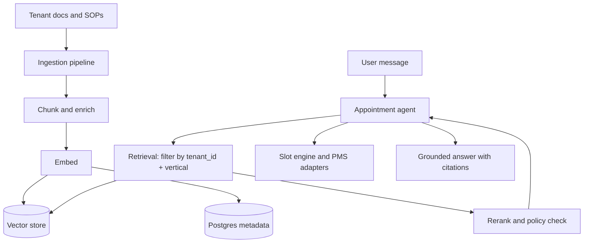

# 08 RAG and Memory Architecture

> Status: proposal — enterprise baseline for the appointment agent.
> Scope: `apps/appointment-agent` + shared RAG pipeline in `packages/`.
> Related: `01-System-Architecture.md`, `02-Recommended-Tech-Stack.md`, `05-Data-Model-and-Database.md`, `06-Security-Privacy-Compliance.md`.

## 1. Purpose

Define how the agent remembers and retrieves knowledge without hallucinating:

1. Session memory for in-progress booking and reschedule flows.
2. Long-term structured memory for tenants, users, and appointments.
3. Retrieval-augmented generation (RAG) for unstructured knowledge such as clinic SOPs, reschedule policies, FAQs, and vertical playbooks.

## 2. Non-Goals

1. No semantic memory for data that is structured and exact. Appointments, slots, and user profiles stay in the primary database.
2. No cross-tenant knowledge leakage. Retrieval is always scoped to one tenant.
3. No autonomous ingestion. Every document has an owner, source, and review date.

## 3. Memory Layers

| Layer | Content | Store | TTL | Source of Truth |
|---|---|---|---|---|
| Short-term session | Current `appointment_id`, `current_slot`, `requested_slot`, `is_confirmed`, last turns | LangGraph checkpoint (`SqliteSaver` local, Postgres saver hosted) | 30-60 minutes idle | No, ephemeral |
| Rolling summary | Compressed intent, constraints, pending action | Checkpoint metadata | Same session | No |
| Structured long-term | Tenant config, user profile, appointment history, preferences | Postgres, `snake_case` tables with `created_at`, `updated_at`, soft delete | Retain per policy | Yes |
| Semantic knowledge | SOP chunks, policy chunks, FAQ chunks, doctor and service descriptions | Vector store + metadata in Postgres | Until superseded | No, Postgres metadata is truth |

Rule: checkpoint explains what the user is doing now. Postgres explains what is booked. Vector store explains how this tenant operates.

## 4. RAG Scope

Index:

1. Tenant SOP per vertical (clinic, dental, salon, physio, home service).
2. Booking, reschedule, cancel, and no-show policies per tenant.
3. Service catalog and doctor or staff profiles.
4. Approved answer templates per channel (WhatsApp, SMS, voice, web).

Do not index:

1. Raw appointment rows, full phone numbers, tokens, or payment data.
2. Unapproved marketing copy.
3. Other tenants data.

## 5. Architecture



The agent calls retrieval as a tool. It never answers policy questions from parametric memory alone when a tenant document exists.

## 6. Ingestion Pipeline

1. Collect from explicit sources only: dashboard upload, connected drive, or seeded vertical pack.
2. Normalize to Markdown, preserve headings, tables, and effective dates.
3. Split by semantic section, target 300-600 tokens with 10-15% overlap. Never split a policy rule across chunks.
4. Enrich each chunk with metadata:

```json
{
  "tenant_id": "clinic_a",
  "vertical": "dental",
  "doc_id": "sop_reschedule_v3",
  "section": "late_cancel_policy",
  "locale": "en",
  "effective_from": "2026-01-01",
  "source_uri": "dashboard://clinic_a/sop_reschedule_v3"
}
```

5. PII scrub before embedding. Reject chunks with secrets or full contact lists.
6. Embed, write vector with `chunk_id`, then upsert Postgres row keyed by `chunk_id`. Postgres is the inventory. Vector store is the index.
7. Version documents. Superseded chunks are marked `is_active = false`, never silently overwritten.

## 7. Retrieval Pipeline

1. Build filter first: `tenant_id = :tenant_id AND is_active = true`, plus optional `vertical` and `locale`.
2. Retrieve top 20 by vector similarity, then rerank to top 5.
3. Drop chunks below a calibrated threshold. Prefer asking a clarifying question over answering from a weak match.
4. Enforce policy precedence: tenant SOP overrides vertical default. Newer `effective_from` overrides older.
5. Pass citations (`doc_id`, `section`) into the prompt. Store used `chunk_id` values in the turn log for audit.
6. Slot facts always come from the slot engine or PMS adapter, never from RAG.

## 8. Multi-Tenant Isolation

1. Logical isolation by mandatory `tenant_id` filter on every query. No unfiltered search path exists in code.
2. Physical option per tier: shared collection with strict filters for SMB, dedicated collection or index for enterprise and healthcare tenants.
3. Tenant onboarding copies the vertical starter pack into the tenant namespace, then applies tenant overrides. Shared defaults are read-only.
4. Deletion is tenant-scoped: `DELETE WHERE tenant_id = :id` in both Postgres and the vector store, verified by count.

## 9. Vector Store Decision

| Option | Use When | Trade-off |
|---|---|---|
| Postgres with `pgvector` | Default for MVP through early scale. One database, one backup, familiar ops. | Simplest ops. Scales to low millions of chunks per tenant set. |
| Qdrant self-hosted | High query load, need payload filtering performance, hybrid search, or on-prem enterprise. | Extra service to operate. Best control for data residency. |
| Managed vector service | Team accepts external data processor and needs zero vector ops. | Fastest ops, highest vendor and compliance review cost. |

Recommendation: start with `pgvector` to avoid a second stateful system. Extract to Qdrant when measured `p95` retrieval latency or filter complexity justifies it. Keep the repository interface stable so the swap is configuration, not a rewrite.

Embedding baseline: one versioned embedding model per deployment. Record `embedding_model` and `embedding_version` on every chunk. Changing models requires full re-embed, tracked as a migration.

## 10. Security, Privacy, and Compliance

1. Encrypt in transit and at rest. Separate keys per environment.
2. Never log chunk content with PII, full phone numbers, tokens, or passwords. Log `tenant_id`, `doc_id`, `chunk_id`, and `request_id` only.
3. Role-based access for ingestion: only tenant admins can publish SOPs.
4. Retention: session checkpoints expire. RAG chunks expire when superseded plus audit retention window.
5. Healthcare tenants: minimum necessary standard, audit trail on retrieval used for patient-facing answers, data processing agreement before enabling managed embeddings.

## 11. Evaluation and Observability

1. Golden set per vertical: 50-100 questions with expected `doc_id` and expected action (answer, clarify, escalate).
2. Metrics: retrieval recall at 5, answer groundedness, escalation precision, no-answer rate on weak matches, `p95` end-to-end latency.
3. Log every RAG turn: query hash, filters, returned `chunk_id` values, rerank scores, final citations, model version.
4. Weekly review of low-score and overridden answers. Bad chunks are fixed at the source document, not patched in prompts.

## 12. Rollout

Phase 1, MVP: Postgres + `pgvector`, manual SOP upload, tenant-scoped filter, golden set for one vertical and one PMS adapter.

Phase 2: reranker, hybrid search, dashboard chunk inspector, supersede workflow, per-tenant collections for large tenants.

Phase 3: Qdrant extraction if justified, cross-channel template grounding, tenant self-serve analytics on unanswered questions.

## 13. Open Decisions

1. Final embedding model and reranker pending latency test on target infra.
2. Final chunk size per channel pending voice versus WhatsApp eval split.
3. Enterprise data residency tier pending first healthcare design partner.

## 14. Validation vs research (23 Sep 2026, subagent RAG)

File ini DINYATAKAN valid dengan koreksi kecil:
- pgvector default CONFIRMED (opini praktisi: start pgvector <10M chunks; dedicated bila bottleneck bernama). Hybrid FTS+vektor+RRF WAJIB untuk pricelist/FAQ (keyword-sensitive) — tambahkan ke §7.
- Memory: LangGraph Store (`PostgresStore`, namespace `[tenant_id, user_id]`) + Collection facts ber-skema (`preferred_time`, `preferred_staff`, `language`, `channel`); thread history tetap di checkpointer; hot-path hanya preferensi eksplisit. https://docs.langchain.com/oss/javascript/concepts/memory
- Embeddings: mulai managed kecil ATAU BGE-M3 (MIT, multilingual, dense+sparse+hybrid) bila self-host; versioned, re-embed = migrasi. https://milvus.io/blog/choose-embedding-model-rag-2026.md
- Eval minimal sebelum tuning chunking: faithfulness + context precision/recall (Ragas). https://docs.ragas.io/en/v0.1.21/concepts/metrics/
- Anti-pattern CONFIRMED: slot availability = tool DB query + validasi kode, JANGAN retrieval embedding (risiko hallucinated slots). LLM hanya format hasil tool.
- Enforcement §18 tanpa Nx: `eslint-plugin-boundaries`/import + apps→packages satu arah + CI lint + CODEOWNERS; Nx `enforce-module-boundaries` hanya bila sudah Nx. https://nx.dev/docs/features/enforce-module-boundaries
