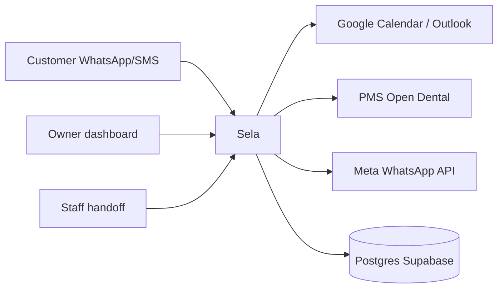
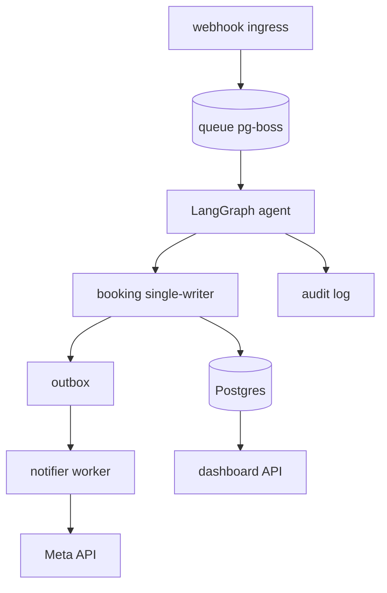

# Architecture — Sela (arc42-mapped)

> Standar isi: arc42 12 section (https://arc42.org/overview/) + diagram C4 L1/L2 cukup untuk kebanyakan tim (https://c4model.com/diagrams). Tiap section map ke file detail agar tanpa duplikasi.

## 1. Introduction & Goals

Resepsionis AI WhatsApp/SMS: nol slot hilang karena telat respon. Quality goals: 0 double-book (stop-line), recovered revenue > fee, time-to-fill <30 mnt pilot. Detail: `docs/02-Product/05-Success-Metrics-and-KPIs.md`.

## 2. Constraints

Meta template policy + pricing per-message; UU PDP (breach 72 jam, ROPA); HIPAA hanya bila PHI AS; kalender vendor sebagai source of truth; single-region PaaS dulu. Detail: `03-Technical/04-Integrations.md`, `06-Security-Privacy-Compliance.md`.

## 3. Context & Scope (C4 L1)

External: Meta, Google/Microsoft, PMS, Supabase, BSP/SMS. Trust boundaries: internet→ingress (HMAC verify), ingress→agent (PII), agent→vendor (OAuth per-tenant), app→DB (RLS+TLS).

## 4. Solution Strategy

Enam keputusan terkunci: monorepo pnpm+turbo; LangGraph (LLM propose, writer dispose); Postgres+queue; Langfuse dulu; GCal dulu; 3 invariant (re-check segar, idempotent, UTC). Detail: `docs/adr/0001`-`0005`, `01-System-Architecture.md`.

## 5. Building Block View (C4 L2)

Monorepo: `apps/appointment-agent` + `packages/{slot-engine,guardrails,mcp-gcal,ui,db}`. L3 per service: TODO (tulis saat service kedua lahir).

## 6. Runtime View

Skenario kritis: reschedule E2E (parse→offer→hold→HITL confirm→write), cancel→waitlist refill, webhook retry storm (dedupe wamid), vendor down (heatmap degradasi). Contoh dialog: `02-Product/04-Conversation-Flows.md`.

## 7. Deployment View

dev (compose lokal) → staging (PaaS + Supabase branch + nomor uji) → prod. CI affected-only (`turbo --filter=[origin/main]`), preview env per PR, rollback artifact sebelumnya. Detail + SLO: `06-Appendix/D-Architecture-Diagrams.md`.

## 8. Crosscutting Concepts

Idempotency key di semua mutasi; outbox + `SKIP LOCKED`; RLS + tenant scoping ganda; PII redaction saat ingestion; hipaa-baseline tanpa klaim; snake_case + docstring + domain exceptions (AGENTS.md).

## 9. Decisions

ADR 0001-0005 di `docs/adr/`. Berikutnya: observability final, PMS kedua, pricing model (lihat Decision-Log D-OPEN).

## 10. Quality Requirements

Goal tree + gate pilot di Success-Metrics; SLO tabel di Appendix D; NFR infra (99,5%, p95 <3 dtk, RPO ≤24 jam) revisi per data pilot.

## 11. Risks & Technical Debt

Register skor di `05-Execution/05-Risk-Register.md`. Tech debt tercatat: `InMemoryCalendar` → `mcp-gcal`; hold TTL di memori → DB; SQLite checkpointer dev → Postgres prod.

## 12. Glossary

`06-Appendix/G-Glossary.md` (wamid, hold TTL, HITL, outbox, RLS, BSC? — isi menyusul).
