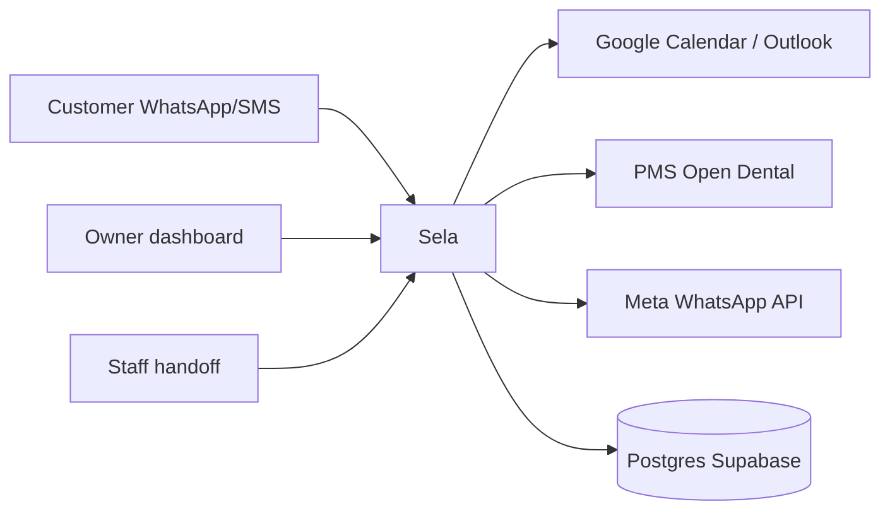
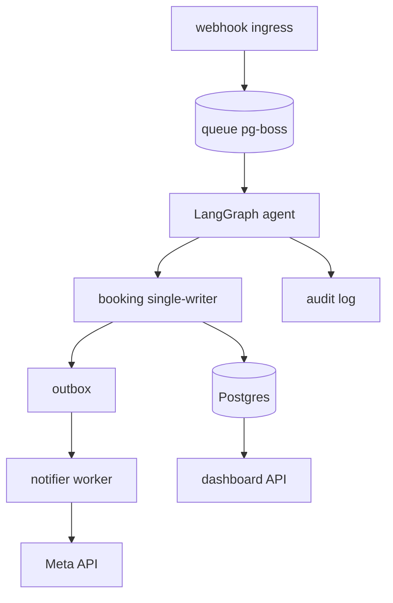

# D — Architecture Diagrams (C4 L1/L2)

## L1 — System context

Trust boundaries (data melewati): internet→ingress (verify signature Meta), ingress→agent (PII chat), agent→vendor (OAuth/token per-tenant), app→DB (RLS + TLS). Rahasia tidak pernah ke log.

## L2 — Container

Aturan: ingress ACK cepat + dedupe wamid; LLM propose, writer dispose; analitik dari audit, bukan trace.

## SLO (awal, revisi per data pilot)

| SLI | Target | Dasar |
|---|---|---|
| Webhook ACK p95 | <3 dtk (budget internal) | Dok WhatsApp tak tulis batas detik; satu-satunya angka resmi Meta (Messenger) ≤5 dtk. https://developers.facebook.com/docs/messenger-platform/webhook/ |
| Booking write sukses | ≥99,9%/bln (ekskl. downtime vendor) | Target builder |
| Availability | 99,5%/bln (~3,6 jam) single-region PaaS | Rekomendasi starter, bukan SLA vendor — SLA numerik Render/Railway tier kecil TIDAK ditemukan |
| Double-book | 0 (stop-line) | Stop-line tetap |
| RPO / RTO | ≤24 jam daily backup Supabase (PITR orde-detik bila bayar ~$100/bln; restore = downtime, uji 1x/kuartal) | https://supabase.com/docs/guides/platform/backups |
| Time-to-fill median | <30 mnt pilot → <15 PMF | Proxy Zocdoc |

Webhook wajib: verifikasi `hub.verify_token` (GET) + HMAC-SHA256 app secret (POST); batching maks 1000/POST tak dijamin; retry menurun 7 hari → dedup `messages[].id`; tanpa API historis → simpan payload sendiri. Validasi payload anjuran Meta tapi WAJIB untuk kita (biaya murah, risiko spoofing mahal). https://developers.facebook.com/documentation/business-messaging/whatsapp/webhooks/create-webhook-endpoint/

## Deployment plan

dev (lokal compose) → staging (PaaS + Supabase branch + nomor WA uji) → prod. CI: checkout `fetch-depth: 0`, `turbo build lint test --filter=[origin/main]` di PR + cache, full run di main. https://vercel.com/academy/production-monorepos/filtering-git-based · https://turborepo.dev/docs/reference/run
Preview env per PR (Render previews / Railway PR envs). Rollback = artifact deploy sukses sebelumnya (Render, retained saja; matikan autoDeploy saat insiden) / Railway redeploy previous. https://render.com/docs/rollbacks · https://docs.railway.com/deployments/deployment-actions
Rilis: migrasi `packages/db` + smoke (liveness + 1 booking E2E). Throughput/worker: ukur sendiri (load test s.d. p95 >3 dtk), jangan tetapkan tanpa data.

## Resilience heatmap

| Gagal | Degradasi |
|---|---|
| Meta WA down | SMS fallback + antre outbox |
| Kalender vendor down | Hold lokal + antre + notif staf |
| DB primer down | Read-only mode + PITR restore |
| LLM timeout | Template deterministik + handoff |

Retry: exponential backoff + jitter, budget maksimal, idempotency key selalu; circuit breaker per vendor; rate-limiter per nomor/portfolio.

## Pola resilience konkret (subagent, Sep 2026)

- Lib: cockatiel (retry + breaker + timeout + bulkhead satu lib TS: `retry(maxAttempts 3, ExponentialBackoff)` + `ConsecutiveBreaker(5, halfOpenAfter 10s)`) bila butuh terpadu; opossum bila butuh breaker standalone + Prometheus/Hystrix. Retry HANYA transient (5xx/timeout/429/putus), jangan 4xx validasi. https://www.npmjs.com/package/cockatiel · https://nodeshift.dev/opossum/
- Outbox: tulis mutasi + baris outbox 1 transaksi; consumer idempotent (kunci wamid/message_id). https://www.freecodecamp.org/news/how-to-fix-the-dual-write-problem-in-node-js-with-the-outbox-pattern/
- WA→SMS fallback terbukti pola vendor (8x8): syarat `msisdn`; `fallbackText` + `sms.{encoding, source}`; conditional `fallbackAfter: 60` + `successStatus: Delivered`. https://developer.8x8.com/connect/docs/whatsapp/whatsapp-sms-fallback/
- GCal tulis gagal → simpan `PENDING_SYNC` + antre retry, JANGAN kirim konfirmasi final. GCal read gagal → tolak booking baru sementara + slot cached bertanda stale. (Inference — contoh nyata tak ditemukan.)
- Alert mulai sebagai warning, kalibrasi 1-2 minggu: outbox-oldest-age, DLQ growth, webhook 5xx rate, GCal-fail streak, backup age. Paging hanya stagnasi persisten (pola `for: 30m`), bukan spike. Jangan hardcode angka domain lain sebagai SLA.
- Compliance mapping: PDP consent→tabel consent + flag revocable; minimization→kolom seperlunya + RLS; retention→TTL job + runbook hard-delete; breach 72 jam→playbook; cross-border→region pin Indonesia; DSR 14 hari→orkestrasi multi-store. Bukan nasihat hukum.
