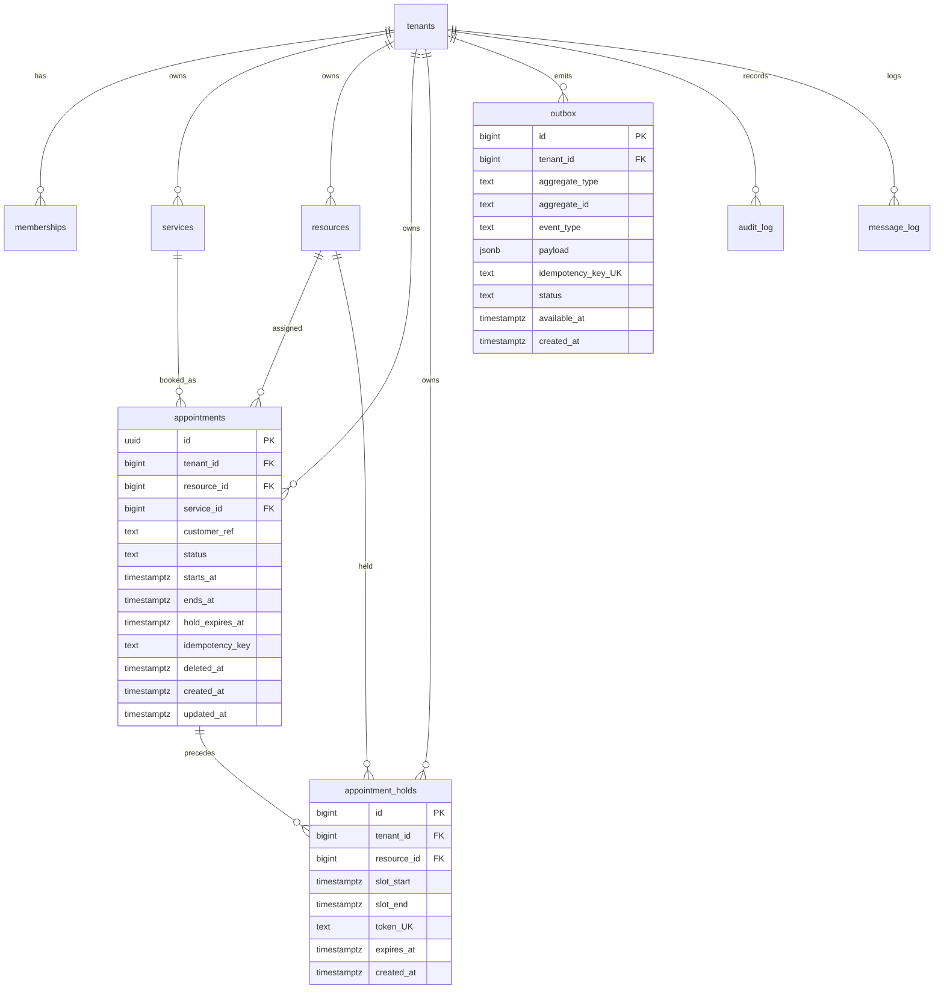

# ERD — Sela appointments

> Render: paste ke Mermaid live editor / GitHub. Sumber pola: Redgate appointment model (appointment sebagai pusat + service/employee/schedule) dimulti-tenantkan + hold/outbox/audit dari `03-Technical/05`.
> https://www.red-gate.com/blog/a-database-model-to-manage-appointments-and-organize-schedules/

