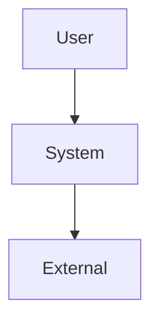
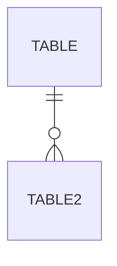
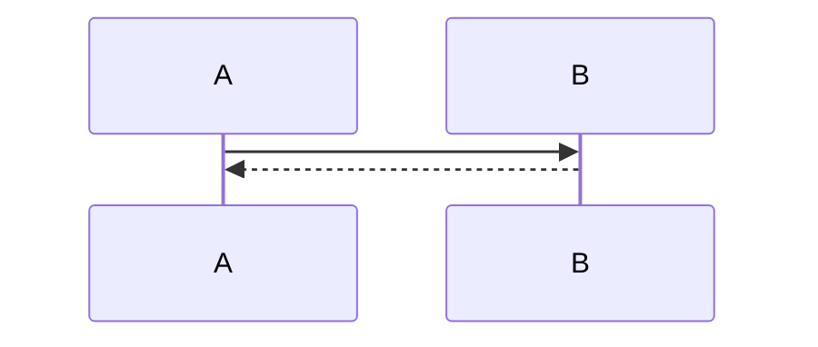

# Design Doc / RFC: [Feature/System Name]

| Field | Value |
|---|---|
| **Title** | |
| **Author** | |
| **Status** | Draft / In Review / Approved / Deprecated |
| **Reviewers** | |
| **Date** | |
| **Related ADRs** | ADR-XXX |
| **Related Docs** | PRD link, One-Pager link |

---

## 1. Summary (TL;DR)

2–3 sentences. If a reviewer only reads this, they must understand what we're building and why.

-

## 2. Context & Problem Statement

Why this document exists. The current pain point — back it with data/metrics where possible, not just "it feels slow."

-

## 3. Goals

Measurable. "Improve performance" is a wish; "P99 latency from 800ms → 200ms" is a goal.

- [ ] Goal 1 (metric + target)
- [ ] Goal 2 (metric + target)

## 4. Non-Goals

Explicitly what we are NOT building. Prevents scope creep and pre-answers "why didn't you also handle X?"

- Not building:
- Not building:

## 5. Proposed Design

### 5.1 High-Level Architecture

C4 Level 1 — system context (our system vs external dependencies).

### 5.2 Component Breakdown

C4 Level 2/3 — what each service/module does.

| Component | Responsibility | Notes |
|---|---|---|

### 5.3 Data Model / Schema

ERD for any persistent data.

### 5.4 API Contract

Endpoint, request/response shape, error codes. Full spec lives in the OpenAPI/protobuf file — link it here.

| Method | Path | Purpose | Errors |
|---|---|---|---|

### 5.5 Sequence Flow

Sequence diagram for critical async/multi-step paths.

## 6. Alternatives Considered

| Alternative | Pros | Cons | Why Rejected |
|---|---|---|---|
| | | | |
| | | | |

## 7. Scalability & Performance

Back-of-envelope calculations — not a precise simulation. If we can't estimate roughly, we don't understand the system.

| Metric | Estimate | Assumption |
|---|---|---|
| Peak QPS | | |
| Storage growth / month | | |
| Latency budget (per component) | | |

## 8. Failure Modes & Mitigation

| Failure | Blast Radius | Mitigation / Fallback |
|---|---|---|
| | | |

## 9. Security & Privacy

Auth model, data sensitivity, who can access what. Keep short unless fintech/health data is involved.

- Auth:
- Data sensitivity:
- Access control:

## 10. Rollout Plan

- Phase 1 (feature flag / canary):
- Phase 2 (wider rollout):
- Full launch criteria:
- **Rollback plan** (mandatory):

## 11. Testing Strategy

Approach only — not detailed test cases.

- Unit:
- Integration:
- Load / stress:

## 12. Open Questions

Be honest about what is not yet known.

- [ ] Open question 1 — owner:
